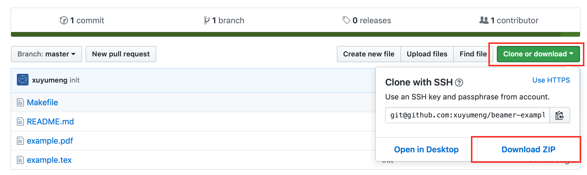

# Beamer Example 模版

## 本代码下载方法（如果你第一次用 github）

点击上面绿色按钮 `Clone or download`, 然后点击 `Download ZIP` 下载，说明截图：


## 注意！Windows 用户请先用记事本打开 tex 文件，复制到自己的文件里！

WinEdit 可能因为默认编码问题，无法直接打开 utf8 编码的文件，请用`记事本`打开，复制内容到自己新建的 tex 文件里。

另外因为旧版本的不支持 demo 用的 `example-image`，我把图片的那一页注释掉了，需要的可以把图片地址改成自己的图片名称，再编译，注释掉的代码如下

```latex
    \begin{frame}
        \frametitle{\textbf{Example of subfigure}}
        \centering
        Idea A $\Longleftrightarrow$ Idea B
        \vskip 2em
        \begin{figure}
            \begin{subfigure}[t]{0.4\textwidth}
                \centering
                \includegraphics[width=\linewidth]{example-image}
                \caption{Image Caption}
            \end{subfigure}\hskip 1em%
            \begin{subfigure}[t]{0.4\textwidth}
                \centering
                \includegraphics[width=\linewidth]{example-image}
                \caption{Image Caption}
            \end{subfigure}
        \end{figure}
    \end{frame}
```

## 使用方法

Macos 和 Linux 用户可以直接在目录下输入以下命令编译

```commandline
make
```

Windows 用户请使用 `WinEdit` 等编辑器编译

## Beamer 模版

Beamer 提供多个预设主题和颜色模版，本例子使用主题模版 `Boadilla`，使用颜色模版 `beaver`。

> 其他主题请参阅 [主题列表](http://deic.uab.es/~iblanes/beamer_gallery/index_by_theme.html) 与 [颜色主题列表](http://deic.uab.es/~iblanes/beamer_gallery/index_by_color.html)

## Beamer 环境

> 注：在 LaTeX 中，内置的标签（命令），比如 `equation`、`table`、`figure`、`section` 称为环境（environment）

### Block

Beamer 中的 block 有三种，在不同主题下显示不同

```latex
\begin{block}{Block Title}
    Content
\end{block}
```

```latex
\begin{exampleblock}{Block Title}
    Content
\end{exampleblock}
```

```latex
\begin{alertblock}{Block Title}
    Content
\end{alertblock}
```